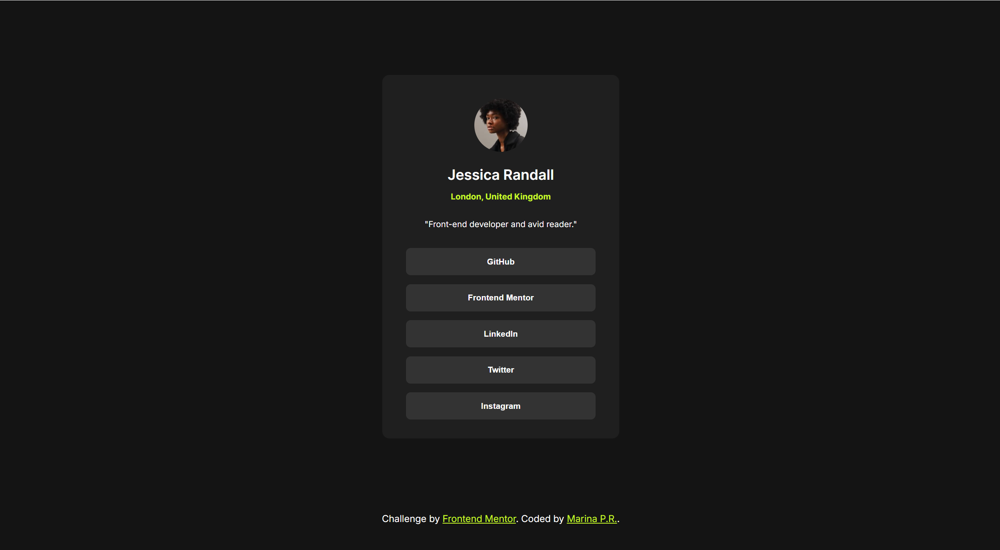

# Frontend Mentor - Social links profile solution

## Overview

### The challenge

Users should be able to:

- See hover and focus states for all interactive elements on the page

### Screenshot

### Links

- Solution URL: https://github.com/MarinaPerezR/social-links-profile
- Live Site URL: https://benevolent-madeleine-ac7ba0.netlify.app/

## My process

### Built with

- Semantic HTML5 markup
- CSS custom properties
- Flexbox
- Mobile-first workflow